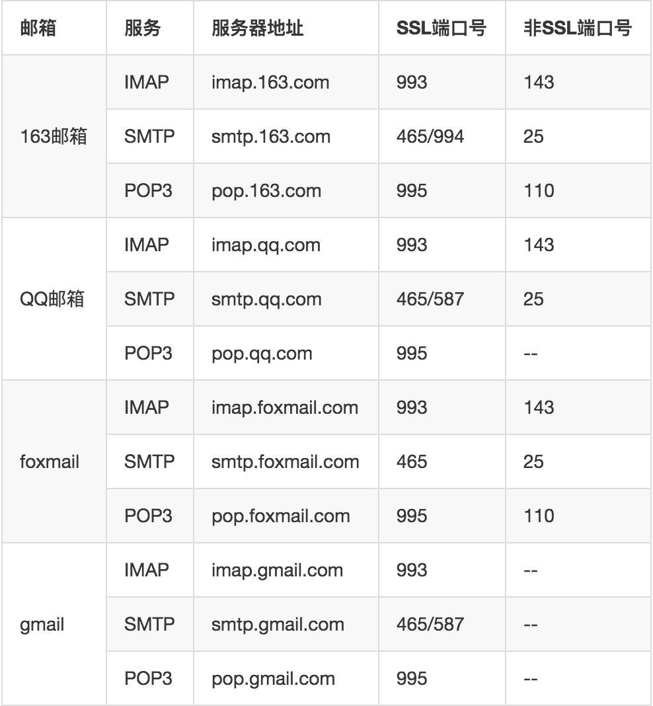

## 1 环境准备

- JDK 1.8（或更高版本）
- MySql5.5（或更高版本）
- Mail Server
- PhantomJs（安装请参考：[phantomjs.org](http://phantomjs.org/)）
- Redis（可选）

## 2 配置部署

1. **初始化目录，将下载好的 Davinci 包（Release 包，不是 Source 包）解压到某个系统目录，如：~/app/davinci**

   ```bash
   cd ~/app/davinci
   unzip davinci-assembly_3.0.1-0.3.0-SNAPSHOT-dist.zip
   ```

   解压后目录结构如下图所示：

   

2. **配置环境变量，将上述解压后的目录配置到环境变量 DAVINCI3_HOME**

   ```bash
   export DAVINCI3_HOME=~/app/davinci/davinci-assembly_3.0.1-0.3.0-SNAPSHOT-dist
   ```

3. **初始化数据库，修改 bin 目录下 initdb.sh 中要的数据库信息为要初始化的数据库，如 davinci0.3**

   ```bash
   mysql -P 3306 -h localhost -u root -proot davinci0.3 < $DAVINCI3_HOME/bin/davinci.sql
   ```

   运行脚本初始化数据库（注：由于 Davinci0.3 系统数据库中包含存储过程，请务必在创建数据库时赋予执行权限）。

   ```bash
   sh bin/initdb.sh
   ```

4. **初始化配置，Davinci0.3 的配置主要包括：server、datasource、mail、phantomjs、cache 等配置**

   进入`config`目录，将`application.yml.example`重命名为`application.yml`
   后开始配置。

   ```bash
   cd config
   mv application.yml.example application.yml
   ```

   ***注：由于0.3版本使用 ymal 作为应用配置文件格式，请务必确保每个配置项键后的冒号和值之间至少有一个空格***

   - **server 配置**

     ```yml
     server:
       protocol: http
       address: 127.0.0.1
       port: 8080
     
       access:
         address: 192.168.1.1
         port: 80
     ```

     server 配置如上示例所示，`server.access.address`和`server.access.port`表示真实访问地址和端口，默认不开启，其值默认为`server.address`和`server.port`。

     如你在虚拟主机上部署 Davinci，启动端口为`8080`，该主机真实访问IP地址为`192.168.1.1`，你将虚拟主机的`8080`端口映射到`80`端口，则需打开 access 配置项，否则将不能正常使用 Davinci 的部分功能，如激活账号、下载、分享等。

   - **datasource 配置**

     这里的 datasource 配置指 Davinci 系统的数据源，配置如下：

     ```yml
     spring:
       datasource:
     	url: jdbc:mysql://localhost:3306/davinci0.3?useUnicode=true&characterEncoding=UTF-8&zeroDateTimeBehavior=convertToNull&allowMultiQueries=true
         username: root
         password: root
         driver-class-name: com.mysql.jdbc.Driver
         initial-size: 2
         min-idle: 1
         max-wait: 60000
         max-active: 10
     ```

     将上一步初始化的数据库地址配置到`url`中，url 中的参数不要做任何修改，然后修改正确的数据库访问用户和密码即`username`和`password`。

     `initial-size`、`min-idle`、`max-wait`、`max-active`是连接池参数，具体属性请参考[DruidDataSource配置属性列表](https://github.com/alibaba/druid/wiki/DruidDataSource%E9%85%8D%E7%BD%AE%E5%B1%9E%E6%80%A7%E5%88%97%E8%A1%A8)

   - **mail 配置**

     ***注：0.3 版本用户采用注册激活的方式维护，所以 mail 配置是此版本必不可少的，且 mail 配置出错率较高，请务必注意***

     ```yml
     spring:
       mail:
         host: smtp.****.com
         port: 25
         username: example@***.com
         password: example_password
         nickname: Davinci
         
         properties:
           smtp:
             starttls:
               enable: true
               required: true
             auth: true
           mail:
             smtp:
               ssl:
                 enable: false
                 
     ```

     mail 配置并不复杂，以上就是完整的 mail 配置了，`username`为邮箱地址，`password`邮箱服务密码，需要注意的是常见免费邮箱（如 163 邮箱、QQ 邮箱、gmail 等）这里应填客户端独立密码，可前往对应邮箱账号设置页面开启 SMTP 服务，并申请客户端授权码（或独立密码，各邮箱提供商叫法不同）。

     下表为常见免费邮箱 SMTP 服务地址及端口：

     

   - **phantomjs 配置**

   phantomjs 是用来定时发送报表截图的，只需要配置安装好的 phantomjs 可执行文件地址即可，如：

   ```yml
   phantomjs_home: /usr/local/bin/phantomjs
   ```

   - **cache 配置（可选）**

   cache 这里用 redis 作为缓存服务，配置如下：

   ```yml
   spring:
   	redis:
   	  isEnable: false
   	  host: 127.0.0.1
   	  port: 6379
   	  
   	#  cluster:
   	#       nodes:
   	
   	  password:
   	  database: 0
   	  timeout: 1000
   	  jedis:
   	    pool:
   	      max-active: 8
   	      max-wait: 1
   	      max-idle: 8
   	      min-idle: 0
   ```

   如果要开启 cache 服务，请将`isEnable`设为`true`，并要设置相关配置（单机方式请打开`host`和`port`，集群方式请打开`cluster`配置项，二者只能选择一种）。

   - **其他配置**

     日志配置文件为`config/logback.xml`，如当前的日志配置不能满足你的要求，可自定义配置日志模式。

## 3 数据源配置

Davinci0.3 理论上支持所有有 JDBC 的数据源，我们默认支持的数据源有：

| 数据源名称    | 驱动类                                                |
| ------------- | ----------------------------------------------------- |
| mysql         | com.mysql.jdbc.Driver                                 |
| oracle        | oracle.jdbc.driver.OracleDriver                       |
| sqlserver     | com.microsoft.sqlserver.jdbc.SQLServerDriver          |
| h2            | org.h2.Driver                                         |
| phoenix       | org.apache.phoenix.jdbc.PhoenixDriver                 |
| mongodb       | mongodb.jdbc.MongoDriver                              |
| elasticSearch | --                                                    |
| presto        | com.facebook.presto.jdbc.PrestoDriver                 |
| moonbox       | moonbox.jdbc.MbDriver                                 |
| cassandra     | com.github.adejanovski.cassandra.jdbc.CassandraDriver |
| clickhouse    | ru.yandex.clickhouse.ClickHouseDriver                 |
| kylin         | org.apache.kylin.jdbc.Driver                          |
| vertica       | com.vertica.jdbc.Driver                               |
| hana          | com.sap.db.jdbc.Driver                                |
| impala        | com.cloudera.impala.jdbc41.Driver                     |

值得注意的是，Davinci 内部只提供了 MySql 的驱动包，也就是说，如果你要使用其他数据源，还需将对应驱动jar 包手动拷贝到`lib`目录并重新启动 Davinci 服务；Davinci 连接 ElasticSearch 目前使用 [NLPchina提供的elasticsearch-sql](https://github.com/NLPchina/elasticsearch-sql)，系统内部默认 ElasticSearch 版本为`5.3.2`，对应的 elasticsearch-sql 版本是`5.3.2.0`，同理，如果你的 ElasticSearch 不是`5.3.2`，首先需要你手动下载 NLPchina 提供的对应版本的 jar，然后替换掉目前`lib`下的 jar，包括`elasticsearch-xxx.jar`、`transport-xxx.jar`、`x-pack-api-xxx.jar`、`
x-pack-transport-xxx.jar`、`elasticsearch-sql-XXX.jar`（`xxx`表示你的 ElasticSearch 版本号，`XXX`表示NLPchina 对应 elasticsearch-sql 版本号）。

另外值得注意的是，如果你的数据源不在以上列表中，也可以通过自定义配置注入数据源，否则没必要开启，除非你知道在做什么：

- 打开自定义数据源配置文件

  ```bash
  mv datasource_driver.yml.example datasource_driver.yml
  ```

- 如下配置你的数据源，这里以 postgresql 为例

  ```yml
  postgresql:
     name: postgresql
     desc: postgresql
     driver: org.postgresql.Driver
     keyword_prefix:
     keyword_suffix:
     alias_prefix: \"
     alias_suffix: \"
  ```

  ***注意***

  - `keyword_prefix`和`keyword_suffix`表示关键字前缀和后缀，假设使用 mysql 数据库，并将`desc`关键字作为字段使用，那么你的查询语句应该是:

    ```select `desc` from table```
    这里的 ‘`’ 就是前后缀，它们必须成对被配置，可以都为空。

  - `alias_prefix`和`alias_suffix`表示别名前后缀，仍以 mysql 为例，假设你的 sql 语句如下：

    ```select column as '列' from table```  

    这里为 ‘column’ 起了别名为‘列’，那么‘'’将作为前后缀配置，前后缀必须成对被配置，可以都为空。

  - 对于以上别名配置，你可以使用`''`将字符包起来，也可以使用转移符`\`，二者只能出现一种。

- 手动将相应的驱动 jar 包拷贝到`lib`目录下。

- 重启 Davinci 服务。